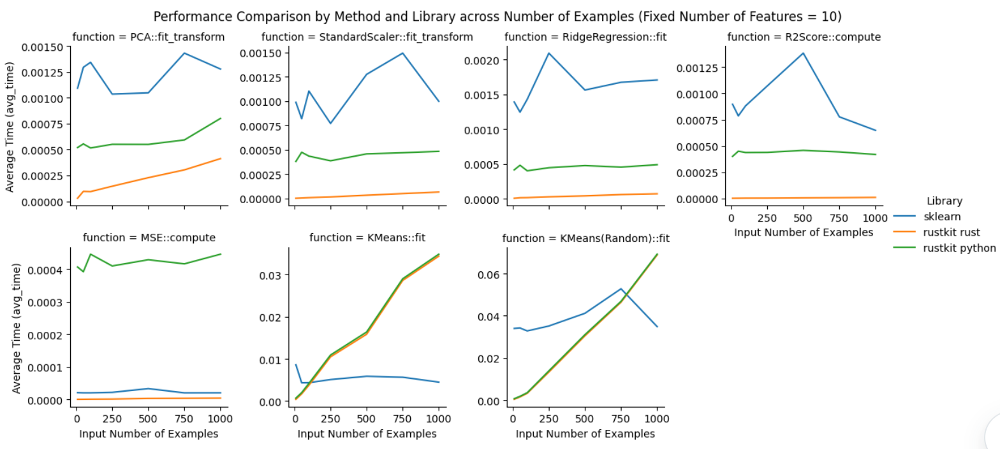
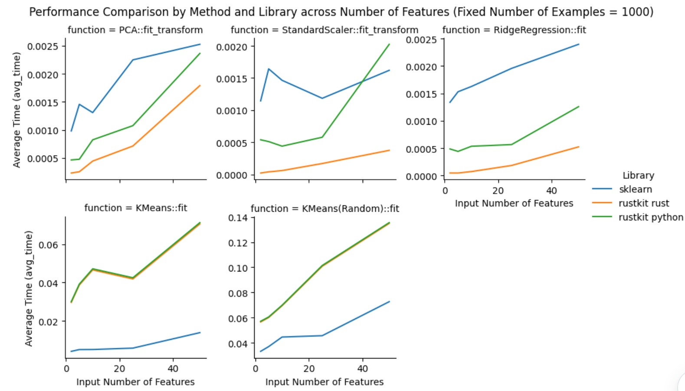

# rustkit

---

## Overview

`rustkit` is a data science library written in Rust, callable from Python, and inspired by `Scikit-Learn`. The underlying Rust implementation relies on the `nalegbra` crate for fast linear algebra and matrix/vector data structures. Like Scikit-Learn, methods are defined through classes (structs) and tend to follow a fit-transform or fit-predict approach for the model (for our supervised, unsupervised, and preprocessing models). Additionally we provide some structs to define testing methods (such as R^2) score etc. See this [presentation](python/presentation.ipynb) for a more detailed overview of benchmarking and accuracy results, as well as examples of calling `rustkit` from Python.

This project includes Python bindings using `maturin` and `PyO3` to use these methods and classes as a library in Python, called `rustkit`. To do so, we implemented converter functions that converted `numpy` matrices and vectors into `nalgebra` matrices and vectors, handling generic types and null values. More information can be found below on building the library for Python.

For now, the methods only accept floats (represented as `f64` in Rust). So far, we have implemented the classes below, grouped by type:

- Preprocessing:
  - Scaler
  - Imputer
- Supervised
  - Ridge Regression
  - With the following Regression Metrics:
    - $R^2$
    - MSE
- Unsupervised
  - KMeans
  - PCA

After implementing the methods in Rust, we created Python bindings using `maturin` and `PyO3` to use these methods and classes as a library in Python, called `rustkit`. To do so, we implemented converter functions that converted `numpy` matrices and vectors into `nalgebra` matrices and vectors, handling generic types and null values.

**_Note_**
Numpy matrices and pandas dataframes in Python tend to handle `None` or `NaN` entries. In Rust, while we can have null entries by storing our data as a `Option<f64>` matrix, most matrix operations are not implementable on Optional values. Thus all of our methods expect **_non-null_** entries, with the exception of `SimpleImputer` which provides imputation methods to ensure that input data is completely non-null.

## Project Structure

This repo contains a folder defining the rustkit [library](rustkit/), as well as a folder containing unit-tests (which compare our output with Sk-learn) and benchmarking in [Python](python/).

### **_rustkit/_**

Our Rust project, `rustkit` follows the following directory structure:

```
rustkit
├───rustkit
│   ├───__init__.py
│   └───**compiled package**
├───src
│   ├───preprocessing
│   ├───supervised
│   ├───testing
│   ├───unsupervised
│   ├───lib.rs
│   └───main.rs
├───Cargo.toml
├───pyproject.toml
└───target
```

- `src` contains all of the of the Rust code needed. The core algorithms are organized by type into modules (e.g. preprocessing, supervised, etc.). Documentation for each class can be found below
- `src/main.rs` prints an example use of all of these algorithms directly in Rust (use `cargo run` from the [rustkit/](rustkit/) folder).
- `src/lib.rs` contains `pyo3` bindings to expose classes, methods, and functions to to the python package when built.
- `src/benchmarking.rs` contains a wrapper function that times and logs the runtime of functions.
- `src/converters.rs` contains wrapper functions that convert to and from Python objects and Rust `nalgebra` objects.
- `Cargo.toml` and `pyproject.toml` enable us to talk to `cargo` and `maturin` to compile and build the crate as both a binary, library, and Python package.

### **_python/_**

- `python/env/` contains files useful for users to easily create a python environment with the necessary packages installed
- `python/logs/` contains benchmarking runtime logs and unit test outputs.
- `python/presentation.ipynb` Jupyter notebook that serves as a demonstration of our package's functionalities and analyzes benchmarking data.
- `python/rustkit_benchmarking.py` and `python/sklearn_benchmarking.py` contain all benchmarking functions that generate log data
- `python/test.py` the Python implementation of `rustkit/main.rs`
- `python/unit_tests.py` contians unit tests of `rustkit` methods

## Quickstart

Create a Python environment with at least Python 3.10, and `pip intall maturin`. For help with this, use the following to create a conda environment with the necessary requirmentes:

- `python/env/environment.yml` - Use the command `conda env create -n <environment-name> -f environment.yml python=3.10` to install the necessary requirements
- `python/env/req.txt` - Use the command `conda create -n <environment-name> -f req.txt python=3.10`

### Building the Library

1. If you don't have the `rustkit/rustkit/` folder, create it.
2. To build the package, run `maturin develop` from the outermost `rustkit/` directory
   - This command compiles the local Rust crate into a Python module and installs it into your local Python environment, in the `rustkit/rustkit/` folder
   - Run `maturin develop --release` if you want the build to be optimized.
3. Within the `rustkit/rustkit/` folder, create `__init__.py`
   - Put the following in `__init__.py`:
     ```python
     from .rustkit import *
     from .rustkit import __all__
     ```
     Now, you should be able to call methods from `rustkit` in Python using `from rustkit import StandardScaler` or `import rustkit`

## Benchmarking Results

We saw impressive results from our benchmarking of the performance of `rustkit` in relation to `sklearn`. We measured the following runtimes:

- `sklearn` method runtime: using wallclock time from the function call to when it returns in Python. See `python/logs/sklearn_benchmarking.csv` for raw data.
- `rustkit` method runtime: using wallclock time from the function call to when it returns in Python, including the full process of converting to/from Rust/Python objects. See `python/logs/rustkit_benchmarking.csv` for raw data.
- `rustkit` Rust internal runtime: using wallclock time from the function call to when the function returns in Rust, excluding all Python interoperability computation. See `python/logs/timing_log.csv` for raw data.

All Python benchmarking was done for 50 iterations. Input matrices ranged from 10 to 1000 rows and 2 to 50 columns. We ran two tests, one where we fixed the number of features (at 10) and varied the number of examples, and one where we fixed the number of examples (at 1000) and varied the number of features.

We see from our results that `rustkit` scales well in comparison to `sklearn` as we increase the number of examples holding number of features constant at 10. We see a lack of scaling ability with `rustkit`'s implementation of `KMeans`. This is becuase `sklearn` parallelizes `KMeans` across multiple CPU cores while the current implementation of `KMeans` in rustkit is not parallelized.


We see similar results as we scale the number of features in relation to a fixed number of examples, 1000. The runtime difference between `rustkit` in Python vs. `rustkit` in Rust increases significantly for `StandardScaler`. This may be because of unoptimized Python/Rust conversion from `numpy` to `nalgebra`.


### Running the Benchmarks

All benchmarking and unit test code is in the `python/` directory.

- `python/rustkit_benchmarking.py` runs all benchmarking tests for `rustkit`. All outputted benchmarks will be written to `python/logs/rustkit_benchmarking.csv`. If you want to start fresh, you must manually delete the entries in the csv file.
  - All Rust-specific runtimes will be written out to `timing_log.csv` in the directory that you run te Python from. This allows one to segment runtime logs since Rust benchmarking is done directly in the Rust source code.
- `python/rustkit_benchmarking.py` runs all benchmarking tests for `sklearn`. All outputted benchmarks will be written to `python/logs/sklearn_benchmarking.csv`. If you want to start fresh, you must manually delete the entries in the csv file.

Benchmark analysis shown above from the raw runtime logs is done in `python/presentation.ipynb`

## Documentation

The underlying data science algorithms are implemented in Rust and rely heavily on the `nalgebra` crate. Below is the documentation for the classes currently available in this project. Each documentation page separates the methods into the external methods (those intended for Python integration) and internal methods (the Rust code to actually run the algorithms / update parameters). Classes are grouped by their type.

### **Preprocessing**

- [SimpleImputer](docs/Simple_Imputer_Documentation.md)
- [StandardScaler](docs/Standard_Scaler_Documentation.md)

### **Unsupervised**

- [KMeans](docs/KMeans_Documentation.MD)
- [PCA](docs/PCA_Documentation.MD)

### **Supervised**

- [RidgeRegression](docs/Ridge_Regression_Documentation.md)

### **Testing**

- [R2Score](docs/R2_Score_Documentation.md)
- [MSE](docs/MSE_Score_Documentation.md)
